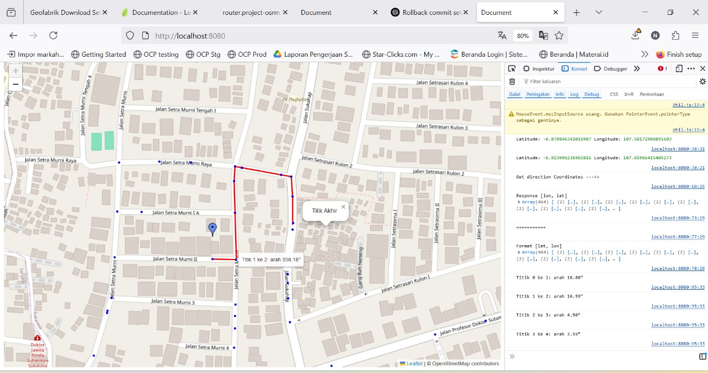
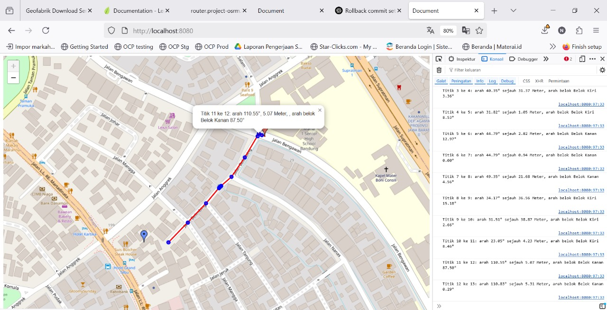

# vechile-otonom
Vechile Otonom with LeafletJs, OSRM Maps, and data from https://download.geofabrik.de/asia/indonesia/java.html

## How To Run Sample

1. Install NodeJs 16+
2. Install http-server ```npm install -g http-server```
3. Run Server ```http-server -p 8080```
4. Open Browser and Access ```http://localhost:8080```

## Preview
Look This Preview :



## How To Use?
1. Click Start Point/ Coordinate in any Map Location
2. Click End Point/ Coordinates in any Map Location
3. Routes atomatic showing in maps, and Circle/ Point detail
4. If check detail please click cicrle information is (Point Info, Azimuth Degree to next point, Distance to next point, Direction and degree from currecnt point )

Example : ```Titik 12 ke 13: arah 110.83° sejauh 5.31 Meter, arah belok Belok Kanan 0.29°```