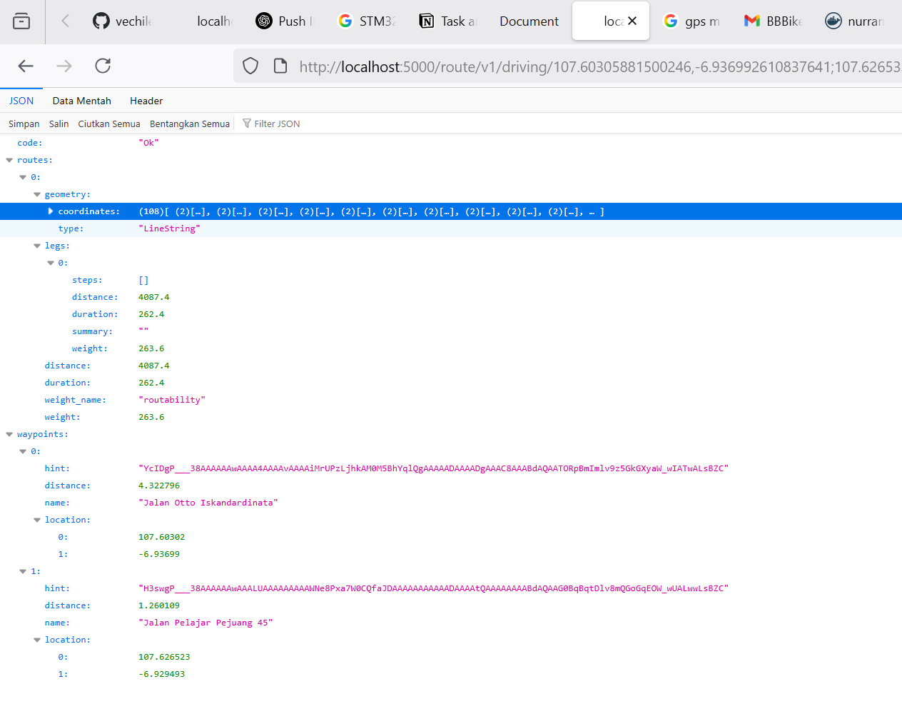
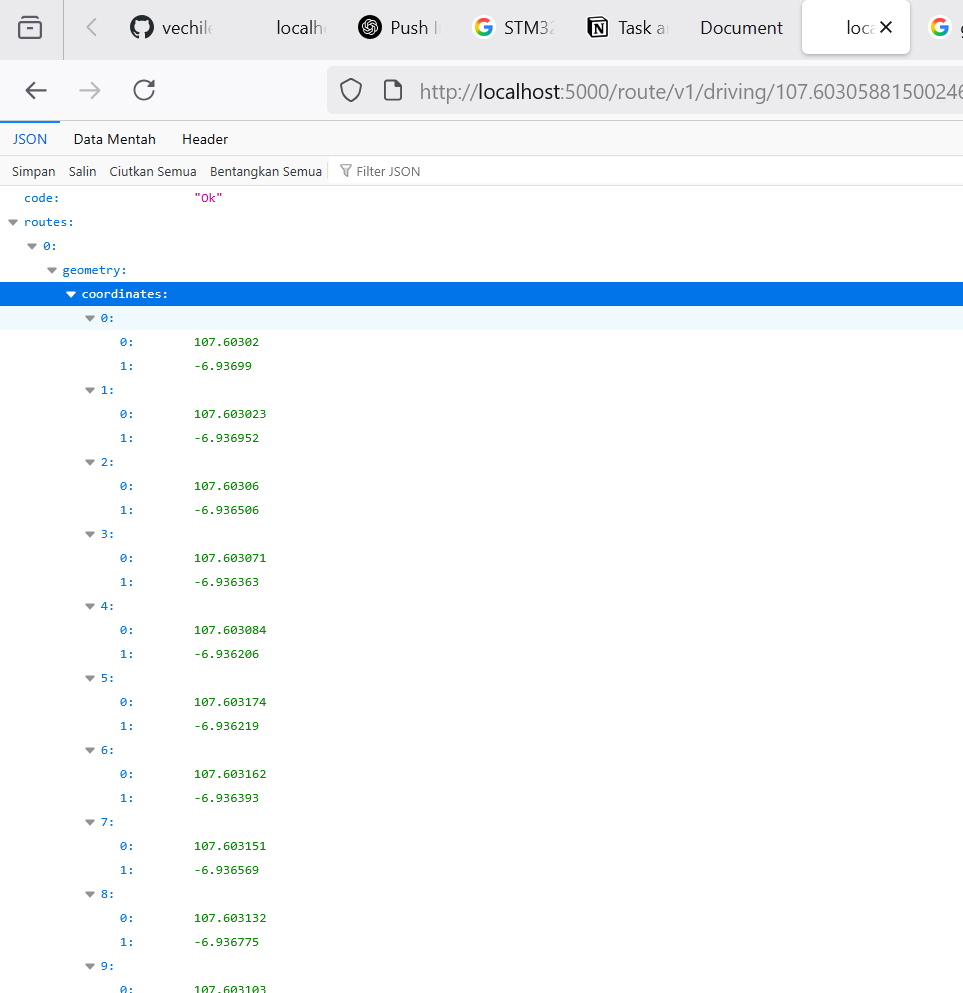

# vechile-otonom
Vechile Otonom with LeafletJs, OSRM Maps, and data from https://download.geofabrik.de/asia/indonesia/java.html

## How To Run Backend
1. Install Docker
2. Open Terminal and Pull Images : ```docker pull nurramdandoni/osrm-jakarta-jabar:v1.0.0``` Url DockerHub : https://hub.docker.com/repository/docker/nurramdandoni/osrm-jakarta-jabar/general
3. Running Image : ```docker run -p 5000:5000 nurramdandoni/osrm-jakarta-jabar:v1.0.0```
4. Test API Route : ```http://localhost:5000/route/v1/driving/${start_longitude},${start_latitide};${end_longitude},${end_latitude}?overview=full&geometries=geojson```

5. Example : Tegalega [Lon, Lat] = [107.60305881500246, -6.936992610837641]  To Talaga Bodas [Lon, Lat] = [107.62653350830078, -6.929496444879571]
   Url : ```http://localhost:5000/route/v1/driving/107.60305881500246, -6.936992610837641;107.62653350830078, -6.929496444879571?overview=full&geometries=geojson```

   

   

## How To Run Sample

1. Install NodeJs 16+
2. Install http-server ```npm install -g http-server```
3. Run Server ```http-server -p 8080```
4. Open Browser and Access ```http://localhost:8080```

## Preview
Look This Preview :


## How To Use?
1. Click Start Point/ Coordinate in any Map Location
2. Click End Point/ Coordinates in any Map Location
3. Routes atomatic showing in maps, and Circle/ Point detail
4. If check detail please click cicrle information is (Point Info, Azimuth Degree to next point, Distance to next point, Direction and degree from currecnt point )

Example : ```Titik 12 ke 13: arah 110.83° sejauh 5.31 Meter, arah belok Belok Kanan 0.29°```